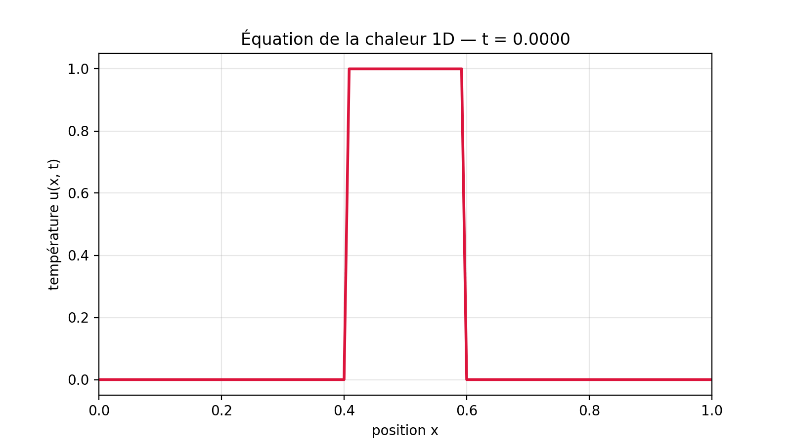
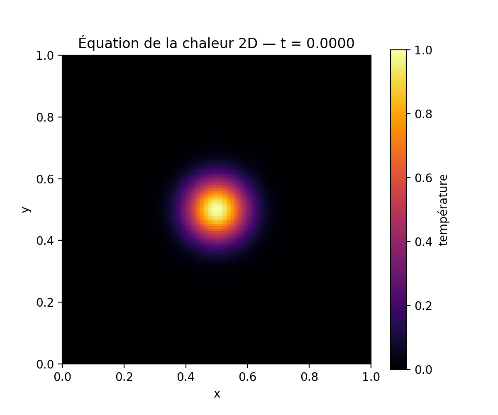

# 🌡️ Heat Equation — Finite Difference Simulation

<p align="center">
  
  
  
  
  
</p>

Numerical solution of the **heat (diffusion) equation** in 1D and 2D using an
explicit finite-difference scheme (FTCS), with animated visualizations.
**Every physical and numerical parameter is tunable from the command line.**

<p align="center">
  
  
</p>

---

## 📦 Installation

Clone the repository, then pick **one** of the two methods below.

### Option A — with [`uv`](https://github.com/astral-sh/uv) (recommended)

`uv` reads `uv.lock` and reproduces the exact same environment, automatically.

```bash
git clone <repo-url> && cd heat-equation
uv run main.py                # creates the env, installs deps, runs — all in one
```

> Don't have uv yet? Install it once:
> `curl -LsSf https://astral.sh/uv/install.sh | sh` (or `brew install uv` on macOS).

### Option B — with plain `pip` (no uv required)

The project uses a standard `pyproject.toml`, so `pip` can install it too:

```bash
git clone <repo-url> && cd heat-equation
python -m venv .venv && source .venv/bin/activate
pip install .                 # pip reads dependencies from pyproject.toml
python main.py
```

> Note: pip resolves the latest compatible versions and ignores `uv.lock`, so the
> environment is slightly less strictly pinned than with uv — fine for this project.

---

## 🚀 Quick start

```bash
uv run main.py                # 1D + 2D with default parameters
uv run main.py --help         # list every available parameter
```

The animations are written to `figures/` (`heat_1d.gif`, `heat_2d.gif`).

## 🎛️ Playing with the parameters

Just pass flags — no need to edit the code:

```bash
# Only the 1D simulation, slower diffusion, finer grid
uv run main.py --dim 1d --alpha 0.5 --nx 201 --t-max 0.2

# Only the 2D simulation, finer grid, faster GIF, different colormap
uv run main.py --dim 2d --nx 201 --ny 201 --fps 20 --cmap viridis

# A hot bar: left edge held at 1.0, right edge at 0.0 (heat flows left→right)
uv run main.py --dim 1d --bc-left 1.0 --bc-right 0.0 --t-max 0.3
```

### All parameters

| Flag | Default | Applies to | Meaning |
|---|---|---|---|
| `--dim {1d,2d,both}` | `both` | — | which simulation(s) to run |
| `--alpha` | `1.0` | 1D & 2D | thermal diffusivity (higher = faster diffusion) |
| `--nx` | `121` | 1D & 2D | grid points along x |
| `--fps` | `12` | 1D & 2D | frames per second of the output GIF |
| `--length` | `1.0` | 1D | length of the bar |
| `--t-max` | `0.08` | 1D | final simulation time (1D) |
| `--bc-left` | `0.0` | 1D | fixed temperature at the left edge |
| `--bc-right` | `0.0` | 1D | fixed temperature at the right edge |
| `--store-every-1d` | `50` | 1D | keep 1 frame every N steps (animation density) |
| `--width` / `--height` | `1.0` | 2D | plate dimensions |
| `--ny` | `121` | 2D | grid points along y |
| `--t-max-2d` | `0.015` | 2D | final simulation time (2D) |
| `--bc` | `0.0` | 2D | fixed temperature on the whole border |
| `--store-every-2d` | `24` | 2D | keep 1 frame every N steps |
| `--cmap` | `inferno` | 2D | Matplotlib colormap |

> 💡 **Stability is automatic.** The time step `dt` is chosen for you to satisfy
> the CFL condition, so increasing `--nx`/`--ny` (finer grid) or `--alpha`
> automatically uses a smaller `dt`. If you ever pass an unstable `dt` manually
> via the Python API, the solver raises a clear error instead of producing
> garbage.

## 🐍 Using the solvers from Python

```python
from src import solve_heat_1d, solve_heat_2d

# 1D — returns (x, times, frames), frames.shape == (n_frames, nx)
x, times, frames = solve_heat_1d(alpha=1.0, t_max=0.08, nx=201)

# 2D — returns (x, y, times, frames), frames.shape == (n_frames, ny, nx)
x, y, times, frames = solve_heat_2d(alpha=1.0, t_max=0.02, bc=0.0)
```

You can also feed a custom initial profile with the `initial=` argument.

---

## 📐 The math behind it

The heat equation describes how temperature `u` diffuses over time:

$$
\frac{\partial u}{\partial t} = \alpha \, \nabla^2 u
\qquad\Longrightarrow\qquad
\begin{cases}
\dfrac{\partial u}{\partial t} = \alpha \dfrac{\partial^2 u}{\partial x^2} & \text{(1D)}\\[2ex]
\dfrac{\partial u}{\partial t} = \alpha\!\left(\dfrac{\partial^2 u}{\partial x^2} + \dfrac{\partial^2 u}{\partial y^2}\right) & \text{(2D)}
\end{cases}
$$

### Numerical method — FTCS

Using **Forward-Time, Central-Space** differences, the 1D update reads:

$$
u_i^{\,n+1} = u_i^{\,n} + r\left(u_{i+1}^{\,n} - 2u_i^{\,n} + u_{i-1}^{\,n}\right),
\qquad r = \frac{\alpha \, \Delta t}{\Delta x^2}
$$

This scheme is **conditionally stable** — the CFL condition must hold:

| Dimension | Stability condition |
|---|---|
| 1D | $r = \dfrac{\alpha \Delta t}{\Delta x^2} \le \dfrac{1}{2}$ |
| 2D | $\alpha \Delta t \left(\dfrac{1}{\Delta x^2} + \dfrac{1}{\Delta y^2}\right) \le \dfrac{1}{2}$ |

**Boundary conditions:** Dirichlet (fixed temperature at the edges).

## 📁 Project structure

```
heat-equation/
├── README.md       # this file
├── pyproject.toml  # dependencies (managed by uv)
├── src/heat.py     # solvers (1D & 2D) + CFL helpers
├── main.py         # CLI demo: generates the animations
└── figures/        # output GIFs & preview
```

## ✅ Sanity checks

- **1D:** the central pulse flattens monotonically (peak 1.0 → 0.18) — diffusion smooths gradients.
- **2D:** total heat decreases as the cold (0°C) boundaries absorb energy.

## 📄 License

Released under the [MIT License](LICENSE) — free to use, modify and share.

_Made by [Rayane Ferrat](https://github.com/rayaneferr)._
